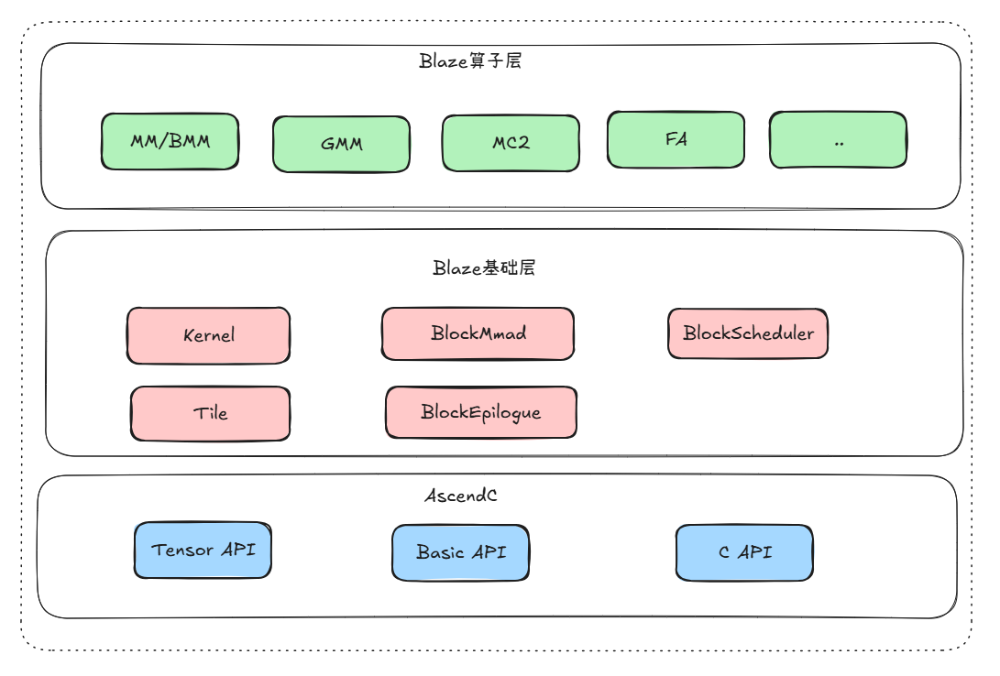
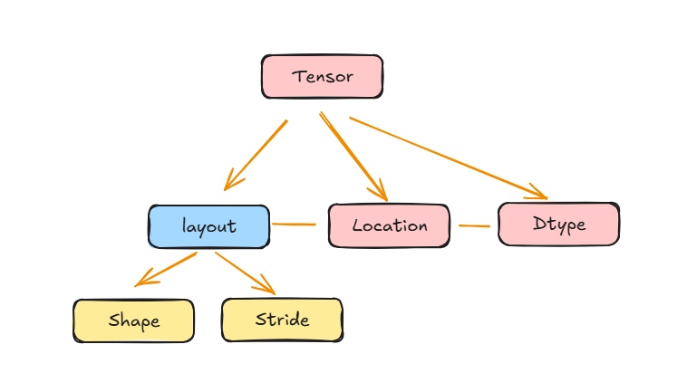
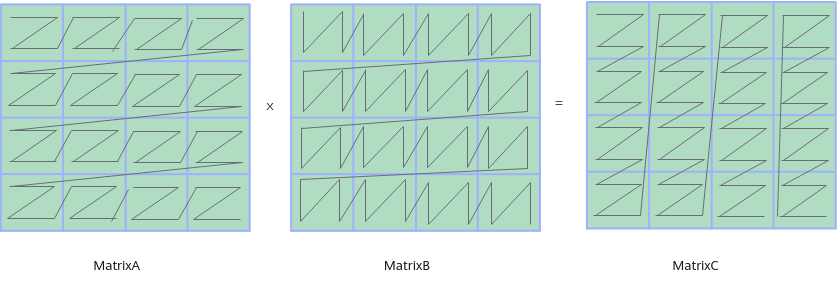
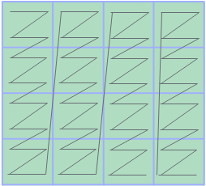
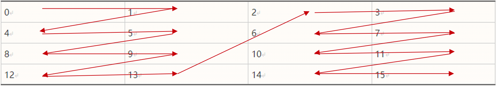
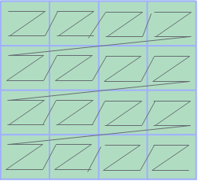
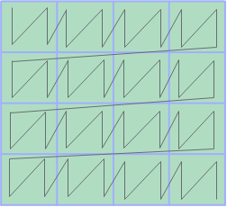

# Blaze 接口文档

## 简介

Blaze (**B**asic **L**inear **A**lgebra optimi**Z**ed **E**ngine) 是一个高性能矩阵乘库，专为华为 Ascend NPU 平台优化。采用分层架构设计，提供灵活的组件组装能力，支持多种矩阵乘场景（Basic、StreamK、Mix、MX 量化和 Weight Quant MX）。

## Blaze 整体架构





## Blaze 层级详解

当前Blaze基础架构基于分层抽象、细粒度策略组合，各层职责清晰，层级关系如下：


### Kernel Layer（Kernel 层）
职责：整体计算流程编排，GM Tensor 创建，多 Block 并行调度。

详细文档：[Kernel 层 API](gemm/kernel/README.md)

### Block Layer（Block 层）
职责：单个 Block 的矩阵乘计算、任务调度。

详细文档：

[Block 层 API](gemm/block/README.md)
包含 `BlockScheduler` 和 `BlockMmad` 组件。

### Epilogue Layer（Epilogue 层 ）
职责：用于矩阵乘计算后的额外处理。不同实现提供不同功能：Empty 为空实现，StreamK 支持 workspace 汇聚、类型转换、ReLU 激活等。

详细文档：
[Epilogue 层 API](epilogue/README.md)

### Tile Layer（Tile 层）
职责：底层辅助组件，数据对齐、Scale 搬运、Trait 定义，以及权重前处理和布局转换。

详细文档：[Tile 层 API](gemm/tile/README.md)

### Policy Layer（策略分配）
职责：调度策略、配置模式定义。

详细文档：[Policy 层](../../include/blaze/gemm/policy/dispatch_policy.h)


## 数据流示意图

### Basic Kernel 数据流
```
┌───────────────────────────────────────────────────────────────┐
│                      GM (A, B, Bias)                          │
└────────────────────────────┬──────────────────────────────────┘
                             │ GM→L1 (BlockScheduler 调度)
                             ▼
┌───────────────────────────────────────────────────────────────┐
│                       L1 (双缓冲)                              │
│               A0|A1  B0|B1  Bias0|Bias1                       │
└────────────────────────────┬──────────────────────────────────┘
                             │ L1→L0 (BlockMmad 迭代)
                             ▼
┌───────────────────────────────────────────────────────────────┐
│                   L0A/L0B (双缓冲)                             │
│                     A_L0  B_L0                                │
└────────────────────────────┬──────────────────────────────────┘
                             │ Mmad 计算
                             ▼
┌───────────────────────────────────────────────────────────────┐
│                          L0C                                  │
│                      C 结果 (float)                           │
└────────────────────────────┬──────────────────────────────────┘
                             │ Fixpipe (L0C→GM)
                             ▼
┌───────────────────────────────────────────────────────────────┐
│                       GM (C 输出)                             │
└───────────────────────────────────────────────────────────────┘
```


## Tensor Layout 概述

### Layout Pattern 类型
Blaze 使用 Ascend Tensor API 的 Layout Pattern 来描述矩阵数据布局：

| Layout Pattern | 说明 | 适用场景 |
|----------------|------|---------|
| `NZLayoutPtn` | NZ格式（fractal布局） | NZ场景，提升L1/L0搬运效率 |
| `ZNLayoutPtn` | ZN格式（fractal布局） | NZ + 转置场景，提升L1/L0搬运效率 |
| `NDLayoutPtn` / `NDExtLayoutPtn` | ND格式（连续布局）/ ND扩展格式 | ND 场景，其中ND扩展格式相比较ND格式支持更加灵活的stride配置 |
| `DNLayoutPtn` / `DNExtLayoutPtn` | DN格式（连续布局）/ DN扩展格式 | ND + 转置场景，其中DN扩展格式相比较DN格式支持更加灵活的stride配置 |


Tensor和Layout关系如下：


### 矩阵乘相关分形格式

数据排布格式（Data Layout Format）是深度学习中对多维Tensor在内存中存储方式的描述。常见的格式包括 NHWC 和 NCHW，它们为张量的每个维度赋予了特定的语义（如批大小、通道、高度、宽度）。除了这些通用格式外，为了充分发挥 AI 计算硬件（如 Ascend AI Core 中的 Cube 计算单元）的并行计算能力，Ascend C还引入了一系列特殊的分形格式，如 FRACTAL_NZ（简称 NZ）、FRACTAL_ZZ 等。这类格式通过重塑数据在内存中的排列方式，显著提升了矩阵乘、卷积等计算密集型运算的效率。

**为什么需要分形格式？**

AI Core 中的 Cube 单元是专为矩阵运算优化的硬件模块，其计算模式并非逐元素操作，而是每次以小数据块(16×16×16)为单位进行并行计算（以half数据类型为例）。为了在一个时钟周期内高效地为计算单元提供数据，内存中的数据必须满足以下条件：

- **连续访问**：计算所需的数据块应尽量连续存储，以最大化内存带宽利用率。

- **数据复用**：合理安排数据布局，使已加载的数据能在多次计算中被重复使用，减少数据搬运开销。

传统的 ND（行优先/列优先）格式虽然适合 CPU 的缓存访问模式，但在面对 Cube 单元的块计算时，数据往往呈现跳跃式分布，导致访存延迟增加、效率降低。为此，分形格式通过数据重组，实现了计算数据在物理内存中的“对齐”。

使用Mmad基础API进行矩阵乘计算时，对矩阵输入输出的数据排布格式有一定的要求，如下图所示，要求A矩阵（位于L0A Buffer）为FRACTAL_ZZ，B矩阵（位于L0B Buffer）为FRACTAL_ZN，C矩阵（位于L0C Buffer）为FRACTAL_NZ。这些格式将矩阵划分成了一些分形（Fractal Matrix），适配Cube计算单元每次读取(16, 16)× (16, 16) 的数据进行计算的硬件特点（以half数据类型为例），从而提高矩阵计算的效率。分形的大小和数据类型有关，也和所在的存储位置有关。



### FRACTAL_NZ / NZ

FRACTAL_NZ格式，简称NZ格式，是对一个Tensor最低两维（一个Tensor的所有维度，右侧为低维，左侧为高维）进行填充（pad）、拆分（reshape）和转置（transpose）操作后得到的格式。具体的转换过程如下：

(M，N)大小的矩阵被分为M1 * N1个分形，按照column major（列优先）排布，形状如N字形；每个分形内部有M0 * N0个元素，按照row major（行优先）排布，形状如Z字形，所以这种数据格式称为NZ格式。其中，(M0, N0)表示一个分形的大小。



通过公式表达为：

```
(…, B, M, N)->pad->(…, B, M1 * M0, N1 * N0)->reshape->(…, B, M1, M0, N1, N0)->transpose->(…, B, N1, M1, M0, N0)
```

**存储示例**

假设分形大小为 2×2，原始 16 个元素按行优先（ND）存储为：

`0, 1, 2, 3, 4, 5, 6, 7, 8, 9, 10, 11, 12, 13, 14, 15`

转换为 NZ 格式后，数据被重组为：

`0, 1, 4, 5, 8, 9, 12, 13, 2, 3, 6, 7, 10, 11, 14, 15`

这种排列使得在计算相邻分形块时，所需数据在物理内存中也保持相邻，极大提高了 Cube 单元的数据吞吐效率。




### 2.2 FRACTAL_ZZ / ZZ

FRACTAL_ZZ格式，简称ZZ格式，是对一个Tensor最低两维（一个Tensor的所有维度，右侧为低维，左侧为高维）进行填充（pad）、拆分（reshape）和转置（transpose）操作后得到的格式。具体转换过程如下：

(M, K)大小的矩阵被分为M1 * K1个分形，按照row major排布，形状如Z字形；每个分形内部有M0 * K0个元素，按照row major排布，形状如Z字形，所以这种数据格式称为ZZ格式。其中，(M0, K0)表示一个分形的大小，分形Shape为16 x (32B / sizeof(Datatype))，大小为512字节。



通过公式表达转换过程如下：
```
(…, B, M, K)->pad->(…, B, M1 * M0, K1 * K0)->reshape->(…, B, M1, M0, K1, K0)->transpose->(…, B, M1, K1, M0, K0)
```

对于不同的数据类型，M0和K0的大小不同：

- 位宽为4的数据类型：M0=16，K0=64。
- 位宽为8的数据类型：M0=16，K0=32。
- 位宽为16的数据类型：M0=16，K0=16。
- 位宽为32的数据类型，M0=16，K0=8。

### 2.3 FRACTAL_ZN / ZN

FRACTAL_ZN格式，简称ZN格式，是对一个Tensor最低两维（一个Tensor的所有维度，右侧为低维，左侧为高维）进行填充（pad）、拆分（reshape）和转置（transpose）操作后得到的格式。具体转换过程如下：

(K, N)大小的矩阵被分为K1 * N1个分形，按照row major排布，形状如Z字形；每个分形内部有K0 * N0个元素，按照column major排布，形状如N字形，所以这种数据格式称为ZN格式。其中，(K0, N0)表示一个分形的大小，分形shape为 (32B / sizeof(Datatype)) x 16，大小为512字节。




通过公式表达转换过程如下：

```
(…, B, K, N)->pad->(…, B, K1 * K0, N1 * N0)->reshape->(…, B, K1, K0, N1, N0)->transpose->(…, B, K1, N1, N0, K0)
```

对于不同的数据类型，K0和N0的大小不同：

- 位宽为4的数据类型：K0=64，N0=16；
- 位宽为8的数据类型：K0=32，N0=16；
- 位宽为16的数据类型：K0=16，N0=16；
- 位宽为32的数据类型：K0=8，N0=16。

分形格式（如 NZ）通过硬件友好的数据重排，解决了传统 ND 格式在矩阵块计算中访存不连续、数据复用率低的问题。它不仅适应了 AI Core 的并行计算特性，也为实现高性能算子（如矩阵乘、卷积）提供了关键的内存布局基础。因此在 Ascend C 编程中，正确使用 FRACTAL_ZZ、FRACTAL_ZN、FRACTAL_NZ 等对应格式，是发挥硬件算力的重要一环。

### Layout 构建流程示例
```cpp
// 1. 定义Layout Pattern类型
using LayoutA = AscendC::Te::NDExtLayoutPtn;      // A矩阵使用ND扩展格式
using LayoutB = AscendC::Te::NZLayoutPtn;         // B矩阵使用NZ格式
using LayoutC = AscendC::Te::NDExtLayoutPtn;     // C矩阵使用ND扩展格式

// 2. 使用FrameLayoutFormat构建Layout
using MakeLayoutA = AscendC::Te::FrameLayoutFormat<
    LayoutA,                                   // Layout Pattern
    AscendC::Std::Int<C0_ELEMENT<AType>>>;     // C0对齐元素数
using MakeLayoutB = AscendC::Te::FrameLayoutFormat<
    LayoutB,
    AscendC::Std::Int<C0_ELEMENT<BType>>>;
using MakeLayoutC = AscendC::Te::FrameLayoutFormat<
    LayoutC,
    AscendC::Std::Int<C0_ELEMENT<CType>>>;

// 3. Layout实例化
auto layoutA = MakeLayoutA{}(m_, k_);  // 创建(m, k)的A矩阵layout
auto layoutB = MakeLayoutB{}(k_, n_);  // 创建(k, n)的B矩阵layout
auto layoutC = MakeLayoutC{}(m_, n_);  // 创建(m, n)的C矩阵layout
```

### Tensor 创建流程示例
```cpp
// 1. 创建GM MemPtr
auto memPtrA = AscendC::Te::MakeMemPtr<AscendC::Te::Location::GM>(aGmAddr_);
auto memPtrB = AscendC::Te::MakeMemPtr<AscendC::Te::Location::GM>(bGmAddr_);
auto memPtrC = AscendC::Te::MakeMemPtr<AscendC::Te::Location::GM>(cGmAddr_);

// 2. 创建GM Tensor
auto gmA = AscendC::Te::MakeTensor(memPtrA, layoutA);
auto gmB = AscendC::Te::MakeTensor(memPtrB, layoutB);
auto gmC = AscendC::Te::MakeTensor(memPtrC, layoutC);

// 3. Tensor Slice操作（获取tile数据）
auto gmBlockA = gmA.Slice(
    AscendC::MakeCoord(coordM, 0L),          // 起始坐标
    AscendC::MakeShape(shapeM, shapeK));     // tile形状
```

### Layout 在矩阵乘中的应用
- **A矩阵**：推荐NDExt格式，灵活处理各种shape
- **B矩阵**：推荐NZ格式，充分利用Cube单元的fractal数据布局，提升搬运效率
- **C矩阵**：使用NDExt格式，便于后续处理和输出
- **Bias矩阵**：使用NDExt格式，按行存储

### C0 对齐说明
不同数据类型的C0对齐元素数：
| 数据类型 | C0_ELEMENT | 说明 |
|---------|-----------|------|
| half (FP16) | 16 | 16个FP16元素 = 32字节 |
| float (FP32) | 8 | 8个FP32元素 = 32字节 |
| fp4x2_e2m1_t (FP4) | 64 | 64个FP4元素 = 64字节 |
| fp8_e5m2_t (FP8) | 32 | 32个FP8元素 = 32字节 |


## 组件组装示意图

```
┌───────────────────────────────────────────────────────────────┐
│                    Kernel 组装示例                             │
├───────────────────────────────────────────────────────────────┤
│ // 定义数据类型和布局                                           │
│ using AType = half;                                            │
│ using BType = half;                                            │
│ using LayoutA = AscendC::Te::NDExtLayoutPtn;                   │
│ using LayoutB = AscendC::Te::NZLayoutPtn;                      │
│                                                                │
│ // 定义 ProblemShape                                           │
│ using ProblemShape = Shape<int64_t, int64_t, int64_t, int64_t>;│
│                                                                │
│ // 组装 BlockScheduler                                         │
│ using BlockScheduler = BlockSchedulerMatmulBasic<...>;         │
│                                                                │
│ // 组装 BlockMmad                                              │
│ using BlockMmad = BlockMmad<                                   │
│     DispatchPolicy, AType, LayoutA,                            │
│     BType, LayoutB, CType, LayoutC, BiasType, LayoutBias>;     │
│                                                                │
│ // 组装 BlockEpilogue                                          │
│ using BlockEpilogue = BlockEpilogueEmpty;                      │
│                                                                │
│ // 组装 Kernel                                                 │
│ using Kernel = GemmUniversal<                                  │
│     ProblemShape, BlockMmad, BlockEpilogue, BlockScheduler>;   │
└───────────────────────────────────────────────────────────────┘
```

## 目录结构

```
blaze/
├── include/blaze/
│   ├── attention/               # Attention 类算子kernel实现
│   │   ├── kernel/                  # Kernel 层组件
│   │   │   ├── kernel_universal.h       # AttentionUniversal 基础模板
│   │   │   └── kernel_flat_quant.h     # FlatQuant Kernel 特化
│   │   ├── block/                   # Block 层组件
│   │   │   ├── block_mmad.h             # BlockMmad 基础模板
│   │   │   ├── block_mmad_flat_quant.h # FlatQuant BlockMmad 特化
│   │   │   └── block_scheduler_flat_quant.h
│   │   └── policy/                  # Policy 层
│   │       └── dispatch_policy.h
│   ├── epilogue/            # Epilogue 层组件
│   │   ├── block_epilogue_empty.h
│   │   ├── block_epilogue_matmul_streamk.h
│   │   ├── block_epilogue_qbmm_pertensor_streamk.h
│   │   └── block_epilogue_flat_quant.h  # FlatQuant AIV 量化后处理
|   └── gemm/
│       ├── kernel/              # Kernel 层组件
│       │   ├── kernel_matmul_basic.h
│       │   ├── kernel_matmul_streamk.h
│       │   ├── kernel_qbmm_cube.h
│       │   ├── kernel_qbmm_mx.h
│       │   ├── kernel_qbmm_mx_without_batch.h
│       │   ├── kernel_matmul_mix_weight_prologue.h
│       │   ├── kernel_wqgmm_mix_weight_prologue.h
│       │   ├── kernel_qbmm_streamk.h
│       │   └── kernel_qbmm_pertensor_streamk.h
│       │
│       ├── block/               # Block 层组件
│       │   ├── block_mmad.h          # BlockMmad 基类
│       │   ├── block_mmad_a8w8_fixpipe_quant.h # Fixpipe Quant BlockMmad
│       │   ├── block_mmad_matmul_basic.h    # Matmul Basic BlockMmad
│       │   ├── block_mmad_matmul_streamk.h  # Matmul StreamK BlockMmad
│       │   ├── block_mmad_qbmm_mx.h         # Qbmm MX BlockMmad
│       │   ├── block_mmad_qbmm_mx_l0c_pingpong.h # L0C PingPong Qbmm MX BlockMmad
│       │   ├── block_mmad_weight_prologue_mx.h
│       │   ├── block_scheduler_matmul_swat_with_tail_split.h
│       │   ├── block_scheduler_matmul_basic.h
│       │   ├── block_scheduler_matmul_streamk.h
│       │   └── block_scheduler_qbmm.h
│       │
│       ├── tile/                # Tile 层组件
│       │   ├── tile_mmad_mx.h
│       │   ├── pad_mx_kl1.h
│       │   ├── copy_gm_to_ub.h
│       │   ├── scale_mx_bias.h
│       │   └── shift_w4_to_w8.h
│       │
│       ├── policy/              # Policy 层
│       │   └── dispatch_policy.h
│       │
│       └── utils/               # Utils 层
│       ├── common_utils.h
│       ├── layout_utils.h
│       └── quant_batch_matmul_constant.h
│
└── docs/API/                # API 文档
    ├── README.md            # 本文档
    ├── attention/           # Attention 层文档
    │   ├── kernel/              # Kernel 层文档
    │   ├── block/               # Block 层文档
    │   └── policy/              # Policy 层文档
    ├── epilogue/            # Epilogue 层文档
    |   └── block/                # Block 层文档
    └── gemm/                # Gemm 层文档
        ├── kernel/              # Kernel 层文档
        ├── block/               # Block 层文档
        └── tile/                # Tile 层文档
```

## 快速开始

### 1. 查看架构图
了解 Blaze 分层设计和数据流 → 本文档

### 2. 选择 Kernel 类型
根据场景选择 Basic、StreamK 或 MX → [Kernel 层 API](gemm/kernel/README.md)

### 3. 组装 Block 组件
选择 BlockScheduler、BlockMmad、BlockEpilogue → [Block 层 API](gemm/block/README.md)

### 4. 了解底层组件
Tile 层辅助组件 → [Tile 层 API](gemm/tile/README.md)

### 5. 配置策略
调度策略和配置 → [Policy 层](../../include/blaze/gemm/policy/dispatch_policy.h)

## 版本信息

- **平台**：华为 Ascend NPU（3510 架构）
- **编译器**：ASC_DEVKIT_MAJOR >= 9
- **量化格式**：MxFP4（fp4x2_e2m1_t, fp4x2_e1m2_t）、MxFP8（fp8_e5m2_t, fp8_e4m3fn_t）
- **Scale 格式**：fp8_e8m0_t（E8M0 浮点）
