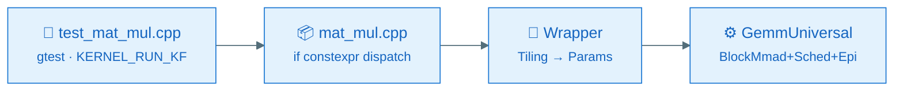
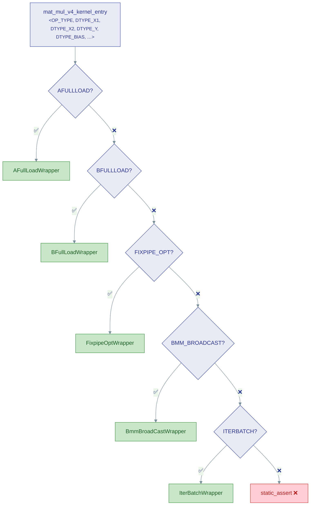
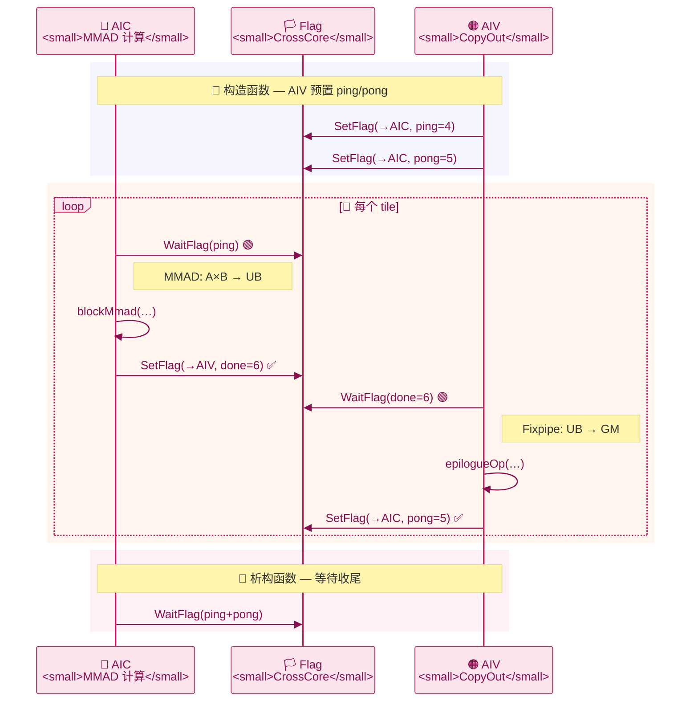

# ops-tensor Kernel UT

## 1. 功能说明

Kernel UT 基于 Google Test 框架，用于验证算子 Kernel 实现的编译正确性和基本功能：

- 验证各算子变体（StreamK、Basic、AFullLoad、BFullLoad、FixpipeOpt 等）在 NPU 模拟器上的编译和 CPU 侧执行
- 通过 `KERNEL_RUN_KF` 宏捕获 kernel 子进程的 crash / exit 状态，解决 `ICPU_RUN_KF` 无法传播子进程失败的问题
- 支持按算子、按 SoC 维度灵活选择编译和测试范围

## 2. 环境依赖

| 依赖 | 最低版本 | 用途 |
|------|---------|------|
| cmake | 3.16 | 构建系统 |
| g++ | 默认 ≥ C++17 | Host 侧 C++ 编译器 |
| bisheng | — | ASC 语言编译器（随 CANN Toolkit 安装） |
| CANN Toolkit | ≥ 9.1.0 | 提供 tikicpulib、ACL 运行时、头文件 |
| gtest | — | 由 cmake 通过 `fetch_cann_cmake` 自动获取 |

> `build.sh --opkernel -u` 会在编译前自动执行 `git submodule update --init include/tensor_api`，确保 Blaze 编译依赖就绪。

## 3. 目录结构

```
tests/
├── CMakeLists.txt                           # L1: 收集 ut/*.cpp 源文件，构建 all_ops_test
├── test_common.cpp / test_common.h          # 公共测试框架（ACLManager RAII 封装）
│
└── ut/
    ├── README.md                             # 本文件
    └── op_kernel/                            # Kernel UT 入口
        ├── CMakeLists.txt                    # L2: 注册算子、编译 kernel 可执行文件
        ├── test_op_kernel_main.cpp           # gtest 主入口（InitGoogleTest + RUN_ALL_TESTS）
        ├── kernel_ut_runner.h               # KERNEL_RUN_KF 宏（stdout 捕获 → 崩溃检测）
        ├── blaze_kernel_stub.h              # __aicore__ / AscendC API CPU stub
        ├── k3_pvwrap.cpp                     # tikicpulib 桩函数
        │
        └── {op}/                             # 算子级目录
            ├── CMakeLists.txt                #   AddOpTestCase(op_name socs flags)
            ├── test_{op}.cpp                 #   测试用例（gtest TEST_F）
            ├── {op}.cpp                      #   各变体 kernel entry 统一分发
            ├── mat_mul_{variant}.h           #   变体 wrapper（host → kernel 桥接）
            └── mat_mul_tiling_data.h         #   Tiling 数据结构定义
```

**层级关系**：

| 层级 | 文件 | 职责 |
|------|------|------|
| `tests/CMakeLists.txt` | L1 | 收集 `ut/*.cpp`，构建 `all_ops_test`（普通 gtest 可执行文件） |
| `tests/ut/op_kernel/CMakeLists.txt` | L2 | 按算子 → SoC 维度构建 `ops_tensor_kernel_ut_{soc}`（Kernel UT 可执行文件） |
| `tests/ut/op_kernel/{op}/CMakeLists.txt` | L3 | 调用 `AddOpTestCase` 注册算子及其支持的 SoC 版本 |

**关键组件说明**：

| 文件 | 说明 |
|------|------|
| `kernel_ut_runner.h` | 提供 `KERNEL_RUN_KF(func, numBlocks, args...)` 宏，通过 stdout 重定向 + 文本解析检测子进程崩溃（IPC 信号无法传递时仍然可靠） |
| `blaze_kernel_stub.h` | CPU 模拟环境下 `__aicore__` kernel stub，提供 `AscendC::GmAlloc/GmFree`、`AscendC::GetBlockIdx()` 等 CPU 侧模拟 API |
| `mat_mul.cpp` | 所有 MatMul 变体的统一入口，基于 `if constexpr` 按 `OP_TYPE` 分发到对应 wrapper |

## 4. 执行方法

### 4.1 通过 build.sh 执行（推荐）

```bash
# 执行全部算子 Kernel UT
bash build.sh --opkernel -u

# 执行指定算子
bash build.sh --opkernel -u --ops=mat_mul
bash build.sh --opkernel -u --ops=mat_mul,quant_batch_matmul
```

`build.sh` 会自动完成：submodule 初始化 → cmake 配置 → 编译 → 运行。

### 4.2 执行个别测试用例

完整编译后，到构建目录用 gtest filter 筛选：

```bash
cd build/kernel_ut

# 运行单个用例
./ops_tensor_kernel_ut_ascend950 --gtest_filter='MatMulV3Test.Test_FP16_Basic'

# 运行某类全部用例
./ops_tensor_kernel_ut_ascend950 --gtest_filter='MatMulV3Test.*'

# 列出全部用例名称
./ops_tensor_kernel_ut_ascend950 --gtest_list_tests

# 模糊匹配
./ops_tensor_kernel_ut_ascend950 --gtest_filter='*AFullLoad*'
```

### 4.3 构建产物

| 产物 | 路径 |
|------|------|
| 构建目录 | `build/kernel_ut/` |
| 可执行文件 | `build/kernel_ut/ops_tensor_kernel_ut_ascend950` |

## 5. 新增算子 UT

以新增算子 `my_op` 为例：

```bash
# 1. 创建算子目录
mkdir -p tests/ut/op_kernel/my_op
```

```cmake
# 2. tests/ut/op_kernel/my_op/CMakeLists.txt
AddOpTestCase(my_op "ascend950pr_9599" "")
```

`AddOpTestCase` 的三个参数：

| 参数 | 说明 | 示例 |
|------|------|------|
| `opName` | 算子名称（子目录名） | `mat_mul` |
| `supportedSocVersions` | 支持的 SoC 版本字符串 | `"ascend950pr_9599"` |
| `extraCompileOptions` | 额外编译选项（如数据类型宏） | `"-DDTYPE_A=half"` |

```cpp
// 3. tests/ut/op_kernel/my_op/test_my_op.cpp
#include "gtest/gtest.h"
#include "kernel_ut_runner.h"

class MyOpTest : public testing::Test {
protected:
    GM_ADDR aGM{nullptr};
    // ...
    void SetUp() override { /* 分配 GM 内存 */ }
    void TearDown() override { /* 释放 GM 内存 */ }
};

TEST_F(MyOpTest, Test_Basic) {
    // 设置 tiling 数据 → 获取 kernel 函数指针 → KERNEL_RUN_KF 执行
    auto kernelFunc = my_op_kernel_entry<OP_TYPE_MYOP_BASIC, half, half, half>();
    ASSERT_TRUE(KERNEL_RUN_KF(kernelFunc, blockNum, aGM, bGM, cGM, workspaceGM, tilingGM));
}
```

注册后即可通过以下方式运行：

```bash
bash build.sh --opkernel -u --ops=my_op
```

## 6. 架构图解

### 6.1 调用链路



| OP_TYPE | kernel_entry | Wrapper | Kernel 特化 |
|---------|-------------|---------|-------------|
| `STREAMK` / `BASIC` | `mat_mul_v3` | `StreamKWrapper` / `BasicWrapper` | `KernelStreamK` / `KernelBasic` |
| `AFULLLOAD` | `mat_mul_v4` | `AFullLoadWrapper` | `KernelAFullLoad` |
| `BFULLLOAD` | `mat_mul_v4` | `BFullLoadWrapper` | `KernelBFullLoad` |
| `FIXPIPE_OPT` | `mat_mul_v4` | `FixpipeOptWrapper` | `KernelFixpipeOpti` |
| `BMM_BROADCAST` | `mat_mul_v4` | `BmmBroadCastWrapper` | `KernelBmmBroadcast` |
| `ITERBATCH` | `mat_mul_v4` | `IterBatchWrapper` | `KernelIterBatch` |

### 6.2 if constexpr 路由



### 6.3 Fixpipe 双核协作

FixpipeOpti 将计算拆分为 **AIC（Cube MMAD）** 和 **AIV（Vector CopyOut）** 两路，通过 CrossCore Flag 乒乓流水。



**Flag 分配表：**

| 名称 | Flag ID | 方向 | 说明 |
|------|---------|------|------|
| `ping` | 4 | AIV → AIC | AIV 完成 copy-out，AIC 可开始下一 tile |
| `pong` | 5 | AIV → AIC | 乒乓交替 |
| `done` | 6 | AIC → AIV | AIC 完成 MMAD，AIV 可开始 copy-out |
| `ping+16` | 20 | AIV → AIC | splitM 场景 M 轴信号 |
| `pong+16` | 21 | AIV → AIC | splitM 场景 M 轴信号 |


